# Actividad2-Contactos
Desarrollo de Interfaces. Actividad 2. Aplicación de gestión de contactos

Realizada por:
Alberto Arroyo Santofimia

**Aplicación de contactos**

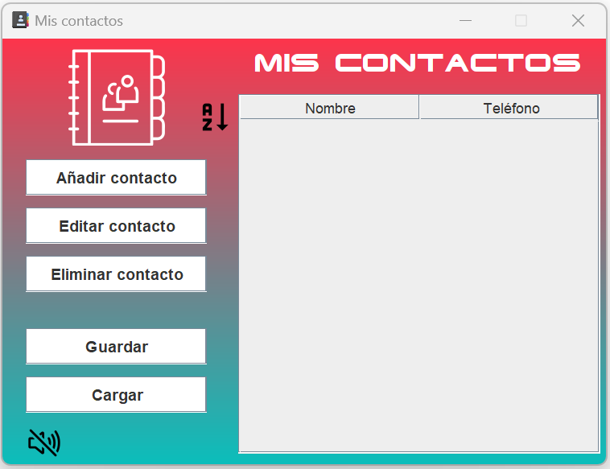{width="5.264159011373578in"
height="4.048818897637795in"}

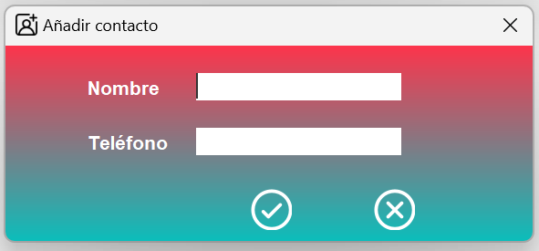{width="4.104377734033246in"
height="1.9098206474190726in"}

Se a cambiado el nombre y el icono que aparece en la aplicación y la
barra de tareas de Windows

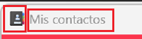{width="1.9584339457567803in"
height="0.5416940069991251in"}

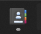{width="0.5833628608923884in"
height="0.49308070866141734in"}

He añadido una fuente externa para poner el titulas de los contactos

{width="3.0348786089238846in"
height="0.38196412948381453in"}

Iconos vectoriales usando svg importando la librería externa FlatLaf
library

<https://github.com/JFormDesigner/FlatLaf>

{width="0.47224628171478567in"
height="0.38196412948381453in"}

{width="0.4375229658792651in"
height="0.4236329833770779in"}

Podemos poner la aplicación son sonido o sin sonido pulsando sobre la
imagen, se cambiará automáticamente y desactiva o activa el sonido según
corresponda

{width="0.4166885389326334in"
height="0.35418525809273843in"}

{width="0.4305774278215223in"
height="0.35418525809273843in"}

Se ha cambiado el fondo de los botones a blanco, quitado el sombreado y
cambiada la fuente original.

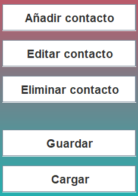{width="1.6111942257217848in"
height="2.2778947944006998in"}

Al posicionarse sobre los botones se sombreará a gris y cambiará el
cursor del ratón

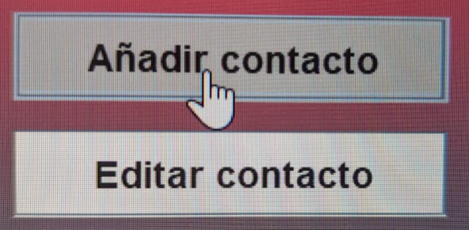{width="3.56168416447944in"
height="1.750761154855643in"}

Y sobre los iconos de ordenar alfabéticamente y sonido, que son imágenes
svg al posicionarse sobre ellos hago que aparezca el fondo del botón
para que se note que son botones tambien y cambio el cursor del ratón.

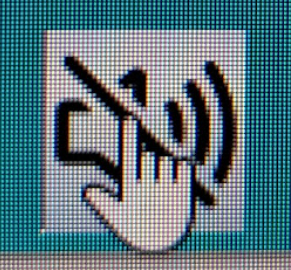{width="0.7284645669291339in"
height="0.6758945756780402in"}

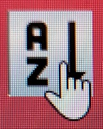{width="0.6441262029746282in"
height="0.8023972003499562in"}

**1º Opción añadir contacto**

{width="1.6389730971128609in"
height="0.4027985564304462in"}

Desplegara la ventana secundaria

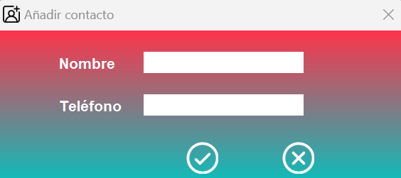{width="3.9168678915135606in"
height="1.7431452318460192in"}

Respecto a la ventana principal se cambia el icono y el nombre

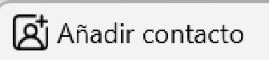{width="2.2155457130358704in"
height="0.4945395888013998in"}

Botones de ok y cancel reemplazados por imágenes svg

{width="2.2722047244094488in"
height="0.7770231846019248in"}

En el campo nombre solo se acepta el abecedario, vocales con acento y el
espacio, si no, no se consume nada en la caja, lo he bloqueado

{width="2.7640310586176726in"
height="0.48613626421697287in"}

Y en la caja del teléfono solo se aceptan 9 números, no se pueden meter
más, todos los números españoles tienen 9 dígitos

{width="2.6737489063867015in"
height="0.38890857392825895in"}

Como requisito, ninguno de los dos campos puede estar vacío para poder
añadirse a la agenda de contactos

Si se deja el campo nombre vacío

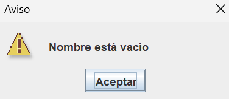{width="2.6112456255468066in"
height="1.1320024059492564in"}

Si se deja el campo teléfono vacío

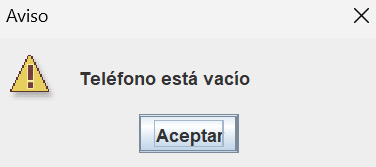{width="2.6112456255468066in"
height="1.1597823709536308in"}

Si el teléfono no tiene nueve dígitos

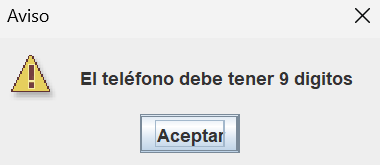{width="2.639024496937883in"
height="1.1458923884514436in"}

Si los dos campos están correctos en nombre se añade

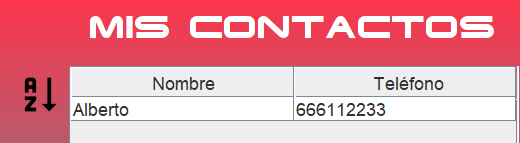{width="3.6112970253718286in"
height="0.9931069553805775in"}

**2º Opción editar contacto**

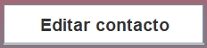{width="1.6111942257217848in"
height="0.37501968503937005in"}

Si no seleccionamos ningún contacto a editar

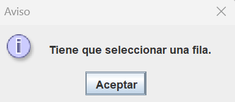{width="2.6737489063867015in"
height="1.1597823709536308in"}

Seleccionamos el contacto a editar y pulsamos en editar contacto,
aparecen los datos del contacto.

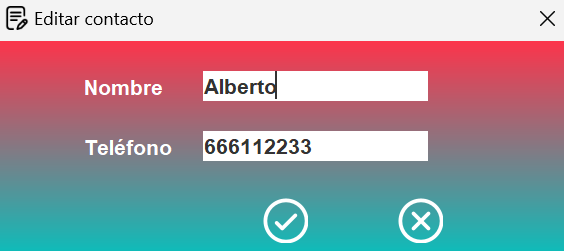{width="3.9168678915135606in"
height="1.7431452318460192in"}

Se ha cambiado el nombre de la pestaña y el icono respecto a añadir
contacto

{width="1.658153980752406in"
height="0.3621259842519685in"}

Si se edita el nombre y se dejan vacíos o el teléfono no tiene nueve
dígitos saltan los mismos avisos que al añadir contacto

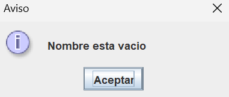{width="2.645968941382327in"
height="1.125057961504812in"}

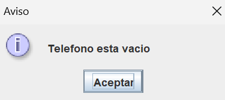{width="2.604300087489064in"
height="1.1667268153980752in"}

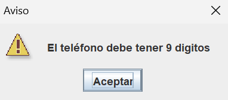{width="2.65291447944007in"
height="1.1736712598425196in"}

Haciendo doble clic sobre el contacto tambien se puede editar

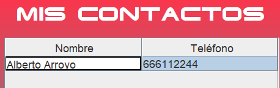{width="3.180718503937008in"
height="1.0069958442694664in"}

**3º Opción eliminar contacto**

{width="1.6250831146106737in"
height="0.37501968503937005in"}

Si no se selecciona contacto a eliminar

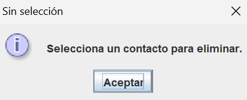{width="2.868203193350831in"
height="1.1667268153980752in"}

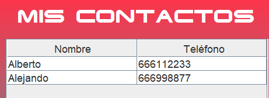{width="3.2015529308836395in"
height="1.1736712598425196in"}

Selecciono contacto a eliminar

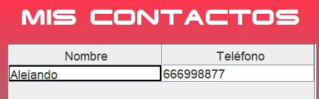{width="3.229332895888014in"
height="1.0000513998250218in"}

**4º Opción guardar**

{width="1.604248687664042in"
height="0.37501968503937005in"}

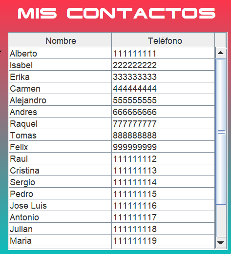{width="3.2848906386701664in"
height="3.618241469816273in"}

Cuando tenemos los contactos en la agenda le damos a guardar, utilizaré
JFileChooser Java Swing y lo guardo en un txt.

Cambia el título de la ventana

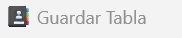{width="1.5689588801399825in"
height="0.32758530183727036in"}

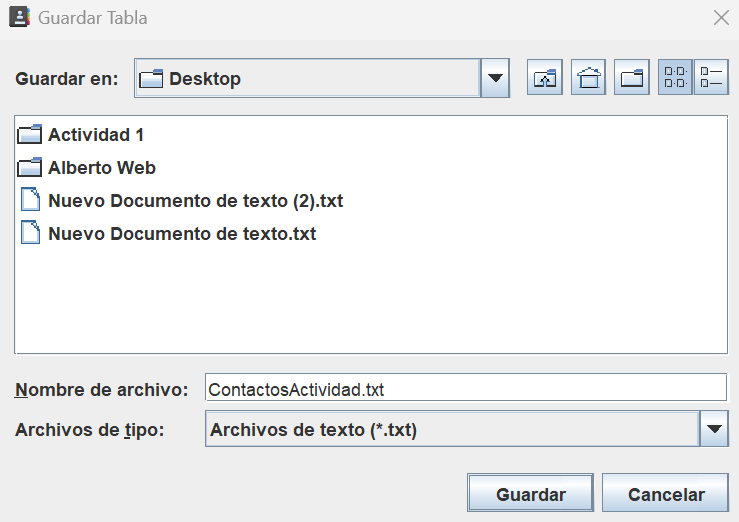{width="5.1322080052493435in"
height="3.6251859142607175in"}

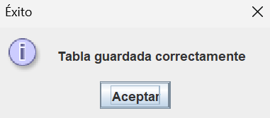{width="2.645968941382327in"
height="1.1597823709536308in"}

**5º Opción cargar**

{width="1.6320286526684165in"
height="0.36807414698162727in"}

Utilizaré JFileChooser Java Swing

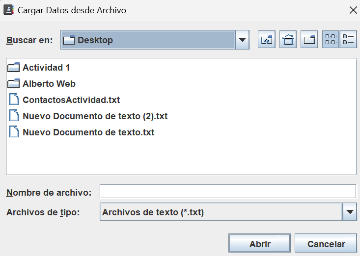{width="5.09053915135608in"
height="3.6251859142607175in"}

Se cambia el título de la ventana

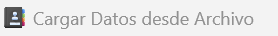{width="2.3644258530183726in"
height="0.3061854768153981in"}

Selecciono el archivo creado anteriormente

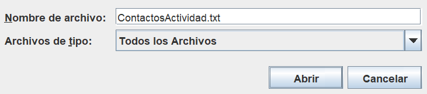{width="5.076650262467192in"
height="1.125057961504812in"}

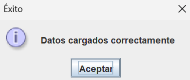{width="2.6320800524934382in"
height="1.1111679790026248in"}

Aparecen los datos en la tabla

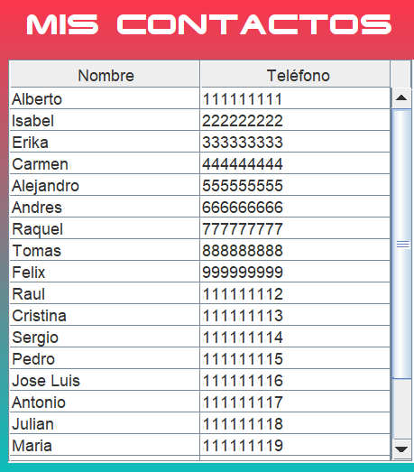{width="3.1876640419947506in"
height="3.6321314523184602in"}

**5º Opción ordenar tabla alfabéticamente**

{width="0.4375229658792651in"
height="0.4305774278215223in"}

Hacer clic sobre el icono y se ordenan alfabéticamente

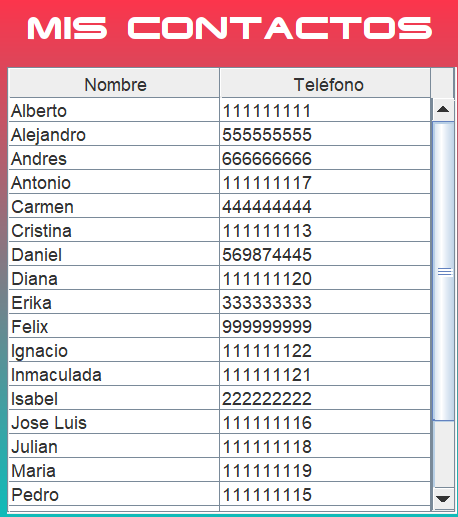{width="3.180718503937008in"
height="3.590462598425197in"}

